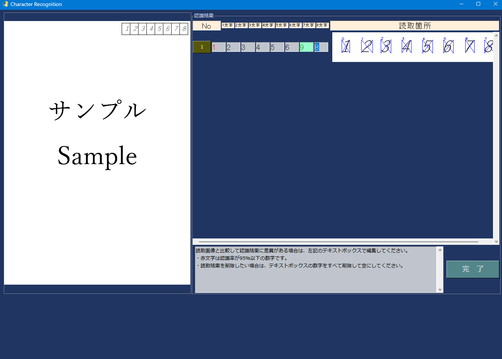

# 設定手順
## 1.環境設定
### Pythonのバージョン
* [3.8.10](https://www.python.org/downloads/release/python-3810/)
  * nnablaが3.8までしか対応していないため
### 仮想環境構築
* ```py -3.8 -m venv .venv```
### モジュールインストール
* ```pip install -r requirements.txt```
---
## 2.Exe化の方法
### Pyinstallerの設定方法
#### 1.下記コマンドで一旦、exeファイルを作成する
* ```pyinstaller main.py --clean --ico=../pyinstaller/pen.ico --version-file ../pyinstaller/VersionInfo.txt --name=OCR申込書読取```
#### 2.specファイルの編集
* specファイル内にPopperの設定を記載する
  * 外部モジュールのpopperのパスを当てなくてはいけない。
  * [参照](https://www.reddit.com/r/learnpython/comments/lp1hi3/how_do_i_include_nonpython_dependencies_to/go93oif/) 
* ```
  a = Analysis(['CharacterRecognition.py'],
  pathex=[],
  binaries=[],
  datas=[],
  hiddenimports=[],
  hookspath=[],
  hooksconfig={},
  runtime_hooks=[],
  excludes=[],
  win_no_prefer_redirects=False,
  win_private_assemblies=False,
  cipher=block_cipher,
  noarchive=False)
  ```
* `binaries`に追加`('./libs/poppler', './binary')`
  * ```
    a = Analysis(['CharacterRecognition.py'],
    pathex=[],
    binaries=[('./libs/poppler', './binary')],
    datas=[],
    hiddenimports=[],
    hookspath=[],
    hooksconfig={},
    runtime_hooks=[],
    excludes=[],
    win_no_prefer_redirects=False,
    win_private_assemblies=False,
    cipher=block_cipher,
    noarchive=False)
    ```
* specファイルにnnablaの設定を追記する
  * `nnabla`とは機械学習モジュール
    * [参照](https://groups.google.com/g/nnabla/c/uMOnv00PVRg)
  * そのままexe化するとエラーがでる
    * 理由
      1. site-packages/nnabla/_variable.cp37-win_amd64.pyd他、.pydが読み込めていない。
      2. site-packages/nnabla/nnabla.confが読み込めていない。
      3. site-packages/nnabla_ext内がexe化対象外
  * 対応
    1. PyInstallerの.specファイルに以下を追記する。
       * ```
         def get_nnabla_path():
         import nnabla
         nnabla_path = nnabla.__path__[0]
         return nnabla_path
         
         a = Analysis(～)
         
         dict_tree = Tree(get_nnabla_path(), prefix='nnabla', excludes=["*.py*"])
         a.datas += dict_tree
         ```
    2. 上記と同様
    3. .pyファイル内に下記を追記
    ```
    import nnabla_ext.cpu
    ```
#### 3.Specファイルの編集後
* ```pyinstaller OCR申込書読取.spec --clean --ico=../pyinstaller/pen.ico --version-file ../pyinstaller/VersionInfo.txt --name=OCR申込書読取```

* .py内で環境変数にパスを通す
```[python]
	poppler_dir = os.path.join(ab_path, POPPER_BIN)
	os.environ["PATH"] += os.pathsep + str(poppler_dir)
```
---

## 3.ディレクトリ構成
* カレントディレクトリ
  * apps
    * characterRecognition.py
    * CONST.py
    * displayGUI.py
    * fileClassification.py
    * main.py
    * rewriteConfig.py
    * setLog.py
    * variables.py
  * libs
    * CONFIG.ini
    * results.nnp
    * startimage.png
    * [popper](https://zenn.dev/torachi0401/articles/poppler_install)
  * pyinstaller
    * .specファイル
    * pen.ico
    * Version.txt
  * logs
  * .gitignore
  * LICENCE
  * README.md
  * requirements,txt

## レイアウト
* 
* 